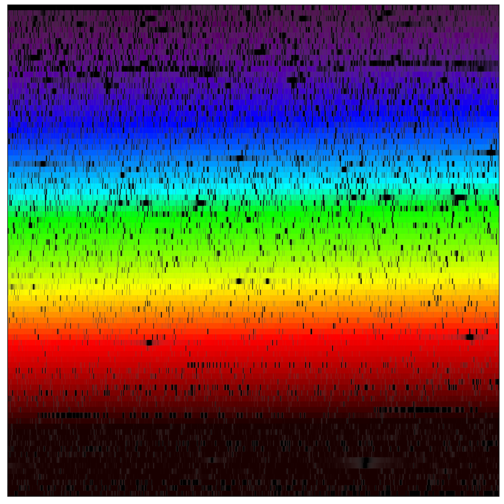

# *VeloceReduction*

This package is designed for the reduction of spectroscopic data from the [Veloce](https://aat.anu.edu.au/science/instruments/current/veloce/overview) spectrograph.

Below are two reduced spectra of the solar-like star alpha Centauri A (HIP71683, [Fe/H] = 0.20 dex) on the left and the metal-poor star HD 140283 (HIP76976, [Fe/H] = -2.48) on right right.

<p align="center">
  
  
</p>

## Installation

> :warning: **Warning:** THIS PACKAGE IS STILL UNDER DEVELOPMENT AND DOES NOT YET INCLUDE ALL NECESSARY FEATURES.

To install this package, we recommend cloning the repository and installing it in development mode to facilitate updates and customization. Please follow the steps below:

```shell
pip install https://github.com/svenbuder/VeloceReduction.git
```

As this package is still in heavy development, you may need to update the package every now and then. You can do so via
```shell
pip install --upgrade https://github.com/svenbuder/VeloceReduction.git
```

These options may fail on computers where you do not have access to `/tmp`. In that case, you have to clone the repository first and then install:
```shell
git clone https://github.com/svenbuder/VeloceReduction.git
cd VeloceReduction
pip install .
```

## Usage Instructions

### Tutorial

The package comes with an interactive tutorial file, called [VeloceReduction_tutorial.ipynb](./VeloceReduction_tutorial.ipynb).  

```python
config.date = 'YYMMDD'
config.working_directory = './'
```

By defauly, it is automatically reducing the data of a fabricated observing run on 22nd November 2000, that is, date = '001122' following the YYMMDD notation. Data are actually taken from a real observing run of Arcturus (HIP69673).

### Expected format of observations directory

The code is expecting observations to be saved in a sub-directory of your working direcory called `observations/`.

In this directory, the code is further expecting each observing run to be saved in the same directory format as the one created by the Veloce observation software:

```bash
observations/               # Directory where the different observing runs are saved.
└── YYMMDD/                  # Date of the observing run
│   ├── YYMMDD-AAT*.log/     # Night Log that is automatically created by Veloce's VC software, e.g. 001122-AAT*.log
│   ├── ccd_1/               # Directory with images of CCD1
│   │   ├── DDmon10001.fits  # Image of exposure 1 taken with CCD1, e.g. 22nov10001.log
│   │   ├── DDmon10001.fits  # Image of exposure 2 taken with CCD1, e.g. 22nov10002.log
│   │   └── ...              # Image of more exposure taken with CCD1
│   ├── ccd_2/               # Directory with images of CCD2
│   │   ├── DDmon20001.fits  # Image of exposure 1 taken with CCD2, e.g. 22nov20001.log
│   │   ├── DDmon20001.fits  # Image of exposure 2 taken with CCD2, e.g. 22nov20002.log
│   │   └── ...              # Image of more exposure taken with CCD2
│   └── ccd_3/               # Directory with images of CCD3
│       ├── DDmon30001.fits  # Image of exposure 1 taken with CCD3, e.g. 22nov30001.log
│       ├── DDmon30002.fits  # Image of exposure 2 taken with CCD3, e.g. 22nov30002.log
│       └── ...              # Image of more exposure taken with CCD3
└── .../                     # Date of another observing run
```

### Output

The software is creating new directories in the working directory that include spectra and other files for each science run:

```bash
reduced_data/                                               # Directory where the different observing runs are saved.
└── YYMMDD/                                                 # Date of the observing run
│   ├── SCIENCENAME/                                        # Name of the science object as given to Veloce's queue.
│   │   ├── veloce_spectra_SCIENCENAME_YYMMDD_overview.pdf  # Image of exposure 2 taken with CCD1, e.g. 22nov10002.log
│   │   └── veloce_spectra_SCIENCENAME_YYMMDD.fits          # Image of exposure 2 taken with CCD1, e.g. 22nov10002.log
│   └── ANOTHER_SCIENCENAME/                                # Directory with images of CCD3
└── .../                                                    # Date of another observing run
```

## Workflow

### Identification of calibration and science runs + tramlines extractions
- Identify calibration runs and science runs from log files.
- For calibration frames, the following are hard-coded to be use:
   - Flat_60.0 (Azzurro), Flat_1.0 (Verde), Flat_0.1 (Rosso)
   - FibTh_180.0 (Azzurro), FibTh_60.0 (Verde), FibTh_15.0 (Rosso)
   - SimLC (Verde), SimLC (Rosso)
   - Dark not yet implemented
- Identify overscan region and its RMS, subtract overscan and trim image
- Join image of same type: calculate median image for calibration runs; co-add images for science runs
- Extract tramlines: use predefined regions from Chris Tinney to identify pixels for each order that will be co-added
- Calculate rough SNR: use sqrt(counts) + read noise, where read_noise is calculated from maximum overscan RMS * nr of pixels. For science runs also multiply read noise by nr of runs, since they are co-added.
- Safe files as veloce_spectra_SCIENCENAME_YYMMDD.fits with one extension per order. Each order has a data table with 6x4128 entries for wave (at this stage only placeholder), science, science_noise, flat, thxe, and lc. ccd and orders can be identified from the FITS extension "EXTNAME" in the form of "CCD_3_ORDER_93" for CCD3's 93rd order.

### Wavelength calibration
- Loop over the science runs
- Read in the veloce_spectra_SCIENCENAME_YYMMDD.fits file
- Loop over each order and use the preidentified thxe pixel -> wavelength combinations to fit a 4th order polynomial wavelength solution.
- This is currently a static solution (assuming and hoping that the pixel -> wavelength positions do not change over the years)
- LC is currently not used to improve wavelength solution
- Overwrite wave placeholders and update veloce_spectra_SCIENCENAME_YYMMDD.fits

## Dependencies

This package requires the following libraries:
- NumPy
- SciPy
- matplotlib
- Astropy

## Author

Sven Buder (ANU, sven.buder@anu.edu.au)

## Contributing

Contributions to enhance and expand this package are highly encouraged. Please feel free to fork the repository, make your improvements, and submit a pull request.

## License

This project is licensed under the MIT License - see the [LICENSE](./LICENSE) file for details.
