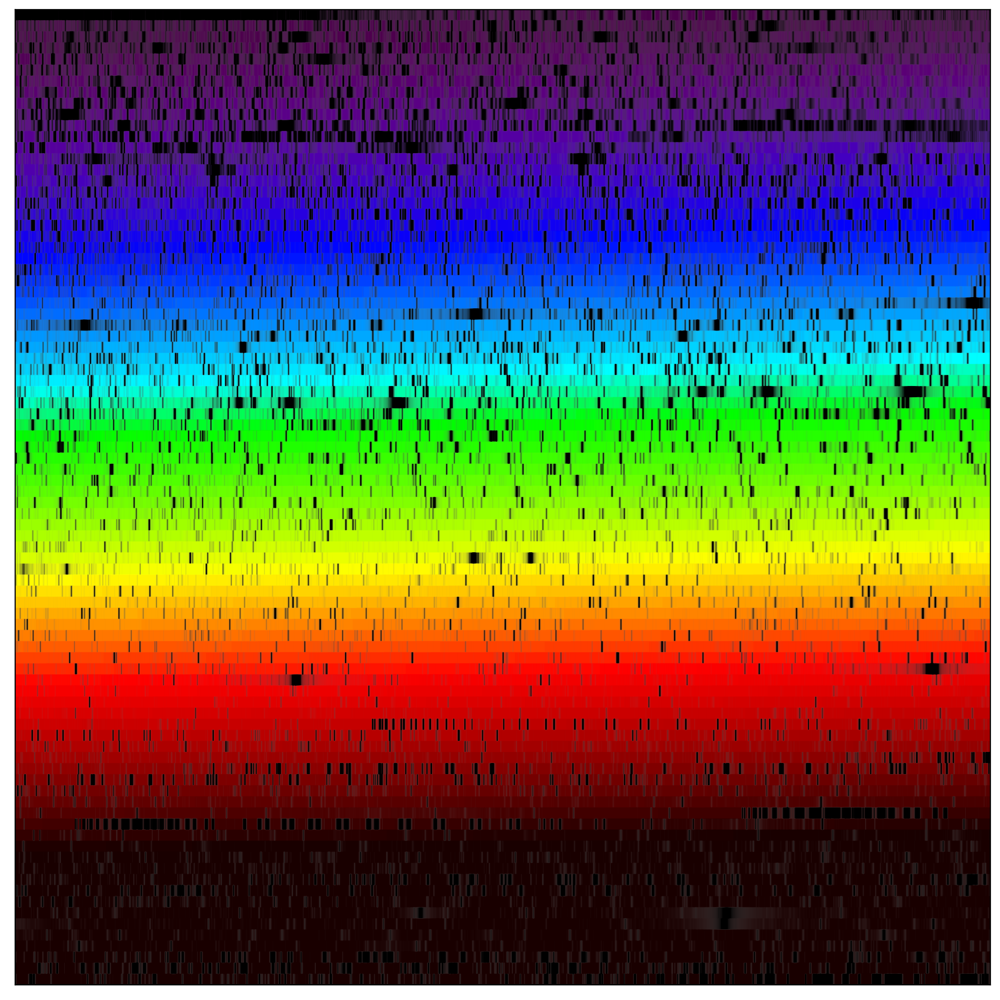
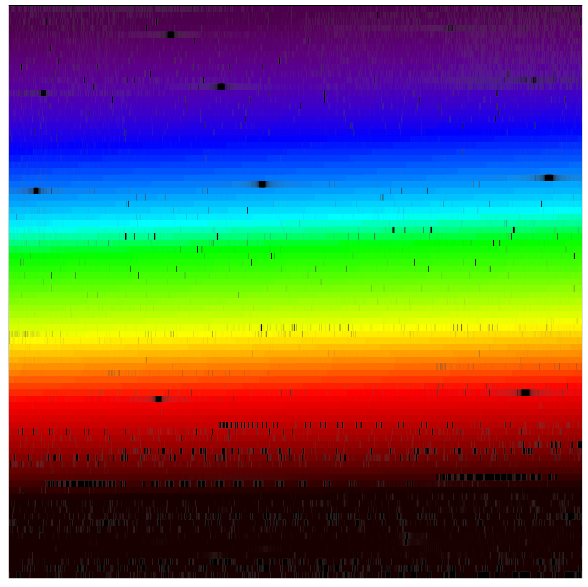

# VeloceReduction

[](https://codecov.io/gh/svenbuder/velocereduction)
[](https://github.com/svenbuder/velocereduction/blob/main/LICENSE)

This package is designed for the reduction of spectroscopic data from the [Veloce](https://aat.anu.edu.au/science/instruments/current/veloce/overview) spectrograph.

The pipeline reduces a complete observing night from raw detector images to wavelength-calibrated science spectra, including flat-fielding, wavelength calibration, barycentric corrections, initial radial velocities, and diagnostic
products.

Below are two reduced spectra of the solar-like star alpha Centauri A (HIP71683, [Fe/H] = 0.20 dex) on the left and the metal-poor star HD 140283 (HIP76976, [Fe/H] = -2.48) on right right.

<p align="center">
  
  
</p>


## Installation

> :warning: **Warning:** THIS PACKAGE IS STILL UNDER DEVELOPMENT AND FEATURES MAY STILL CHANGE.

To install this package, the best way is to clone the repository and installing `velocereduction` in development mode (using `pip install -e`) to facilitate updates and customization.  
If you only want to use the package and not adjust the code, you can simply use:

```shell
pip install https://github.com/svenbuder/velocereduction.git
```

As this package is still in heavy development, you may need to update the package every now and then. You can do so via
```shell
pip install --upgrade https://github.com/svenbuder/velocereduction.git
```

These options may fail on computers where you do not have access to `/tmp`. In that case, you have to clone the repository first and then install:
```shell
git clone https://github.com/svenbuder/velocereduction.git
cd velocereduction
pip install .
```

## Start here

The easiest way to understand the pipeline is to open:

    reduce_night.ipynb

This notebook is the master workflow for reducing one complete night.

The corresponding command-line version is:

    reduce_night.py

`reduce_night.py` is generated from the notebook and should not be edited
independently.

---

## Running a night

### Interactive

Open `reduce_night.ipynb` and set:

    night = '001122'

near the top of the notebook.

### Command line

    python reduce_night.py 001122

By default the pipeline uses:

    log level:     INFO
    diagnostics:   basic

For a full developer/debug reduction:

    python reduce_night.py 001122 --log-level DEBUG --diagnostics full

For a fast production reduction without diagnostic figures:

    python reduce_night.py 001122 --diagnostics none

Use:

    python reduce_night.py --help

for all options.

---

## Pipeline overview

A complete night is processed in the following order:

1. Identify and classify all observations
2. Prepare detector images and dark information
3. Create the master Flat
4. Measure detector shifts and nightly tramline geometry
5. Create flat-response and blaze products
6. Extract SimLC and FibTh wavelength-calibration spectra
7. Fit the wavelength solution
8. Extract science spectra
9. Calculate barycentric velocity corrections
10. Measure initial radial velocities
11. Extract and analyse B-star/telluric observations
12. Save science products, diagnostic figures, and reduction summary

The notebook deliberately contains only high-level pipeline calls.
The implementation of each step is kept in the corresponding Python module.

---

## Code organisation

    velocereduction/
        utils.py          File handling, night setup, logging, detector utilities
        flat.py           Master Flat, response Flat, blaze
        tramlines.py      Detector shifts, order traces, extraction regions
        extraction.py     Summed and fibre-resolved spectral extraction
        wavelength.py     SimLC/FibTh wavelength fitting and wavelength assignment
        velocities.py     Barycentric corrections and radial velocities
        tellurics.py      B-star and telluric measurements

For example:

    tramlines.fit_nightly_tramlines(...)

is implemented in `tramlines.py`.

Functions beginning with `_` are internal implementation details and normally
should not be called from the master pipeline.

---

## Diagnostic levels

Text logging and diagnostic figures are controlled independently.

### Logging

    DEBUG
        Detailed developer information

    INFO
        Normal reduction progress and important measurements

    WARNING
        Potential problems and fallbacks

    ERROR
        Failed reduction steps

All pipeline logging is written to:

    reduction_process_log_YYMMDD.txt

### Diagnostic products

    none
        No diagnostic figures. Intended for fast batch reductions.

    basic
        Important night-level figures showing whether the reduction succeeded.
        This is the default.

    full
        Complete developer diagnostics, including per-order and per-exposure
        figures. Intended for debugging and the reference-night test suite.

Useful retained figures are written to:

    figures/

Verbose developer diagnostics are written to:

    debug/

---

## Input and output structure

Raw observations are linked under:

    observations/YYMMDD/

Reductions are separated by VeloceReduction version:

    reductions/
        vr_X.Y.Z/
            YYMMDD/

For example:

    reductions/vr_0.6.0/001122/

Each reduced night contains:

    night_overview/
    reduction_input_YYMMDD.txt
    reduction_process_log_YYMMDD.txt
    reduction_summary_YYMMDD.txt

    calibrations/
        detector/
        flat/
        wavelength/

    science/
        summed/
        fibre/

    figures/
    debug/

The top-level text files answer:

    reduction_input    What observations went into the reduction?
    process_log        What did the pipeline do?
    reduction_summary  What came out and were there any problems?

---

## Extraction products

The initial pipeline uses summed extraction across the cross-dispersion
direction:

    extraction_mode = 'summed'

A future fibre-resolved mode will use:

    extraction_mode = 'fibre'

The same distinction applies to Science, SimLC, and FibTh products.

The extraction method and pipeline version are stored in the FITS metadata.

---

## Wavelength calibration

Both SimLC laser-comb spectra and FibTh spectra contribute to the wavelength
solution.

Extracted calibration observations are stored under:

    calibrations/wavelength/

with their exposure identifiers and MJD midpoint recorded in both the filename
and FITS metadata.

---

## Tests

Run the fast test suite with:

    pytest

Tests include:

- unit tests of individual algorithms
- synthetic detector/extraction tests
- small integration tests
- regression tests using reference night `001122`

The complete reference-night debug reduction is run separately through
GitHub Actions with:

    log_level='DEBUG'
    diagnostics='full'

Code coverage is monitored with Codecov.

When fixing a bug, add the smallest possible test that reproduces the problem
before applying the fix.

## Dependencies

The is only tested for Python >= 3.9. It requires the following libraries:  
- numpy
- scipy
- matplotlib
- astropy
- scikit-image

## Author

Sven Buder (ANU, sven.buder@anu.edu.au)

## License

This project is licensed under the MIT License - see the [LICENSE](./LICENSE) file for details.