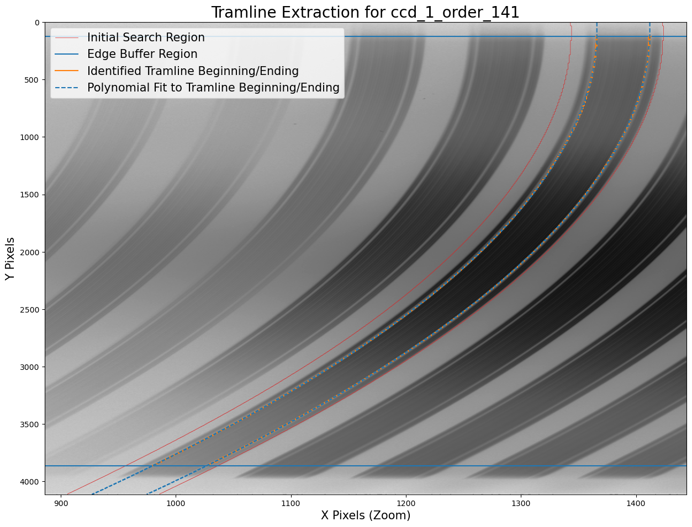

# Summary

`velocereduction` is a Python package for the automated reduction of stellar spectra obtained with the fibre-fed échelle spectrograph [Veloce](https://aat.anu.edu.au/science/instruments/current/veloce/overview) [@Case2018] at the 3.9-m Anglo-Australian Telescope. The package supports all three Veloce arms — Rosso [@Gilbert2018], Verde, and Azzurro [@Taylor2024] — and provides a reproducible pipeline to convert raw CCD exposures into wavelength-calibrated, flattened, and optimally extracted spectra.

Using both science and calibration frames, `VeloceReduction` automates all major steps of nightly data processing, including:
- bias and overscan subtraction,
- order tracing and extraction,
- flat-fielding,
- wavelength calibration with ThXe arc lamps, laser comb (LC) exposures, as well as a range of synthetic spectra produced with the spectrum synthesis code Korg [@Wheeler2023,@Wheeler2024],
- and quality-control plotting.

{ width=95% }

It handles data across all 110 echelle orders of the Veloce spectrograph, which covers a spectral range from 390 nm to 940 nm as shown in \autoref{fig:example_spectrum}. The package automatically handles observations via 2 and 4 Amplifier readout (2Amp and 4Amp).

{ width=50% }

# Statement of need

`velocereduction` is designed to meet a critical need within the astronomical community for automatic, efficient, versatile, and reliable reduction of spectra obtained from the [Veloce](https://aat.anu.edu.au/science/instruments/current/veloce/overview) spectrograph. This software automates the reduction process, enabling astronomers to quickly assess the quality of spectra across the wavelength range from 390 to 940 nm. Such capabilities are indispensable for large observational programs that are operated with the spectrograph and demand rapid feedback on spectral quality to adjust observing strategies in real-time.

The primary goal of these programs is to advance our understanding of elemental abundances in stars in the research field of astronomy. The wavelength range of the Veloce spectrograph includes information for up to 38 different elements and some isotope ratios. Accurate and detailed absorption feature extraction and careful and precise elemental abundance measurements can reveal significant insights into the processes that govern stellar evolution and the chemical enrichment of stars and galaxies [@McKenzie2024]. These measurements are crucial for probing stellar nucleosynthesis processes and for investigating the origin of elements, a cornerstone of astrophysical research [@Jofre2019].

# Implementation

`velocereduction` is implemented in Python (≥ 3.9) and builds on standard scientific libraries including `astropy` [@Robitaille2013,@PriceWhelan2018], `numpy` [@numpy], `scipy` [@Scipy], and `matplotlib` [@matplotlib]. The package is fully open-source under the MIT license and tested via GitHub Actions with code-coverage reports. Example data and configuration files are included for reproducibility, and all modules can be executed from the command line or integrated into custom Jupyter workflows.

# Acknowledgements

We acknowledge contributions from Chris Tinney, namely the information on overscan regions, initial tramlines of orders across the spectrograph and the cartographing of ThXe arc lines across these orders. This work supported by the Australian Research Council under grant numbers DE240100150 and CE170100013.

# References
