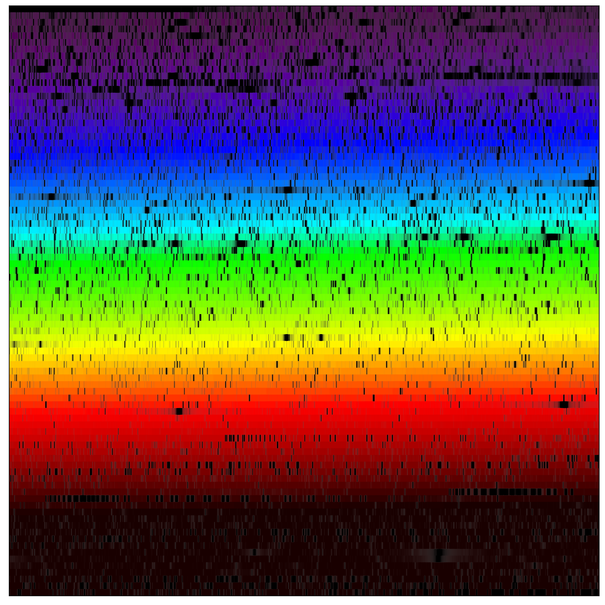

# Summary

Summary text of Veloce. Include citations to @Case2018 for the IFU Fibre feed and @Gilbert2018 for Rosso as well as @Taylor2024 for the upgrade of Verde and Azzurro.

{ width=50% }

# Statement of need

This is needed for reducing Veloce spectra quickly.

# Acknowledgements

We acknowledge contributions from ....

# References
